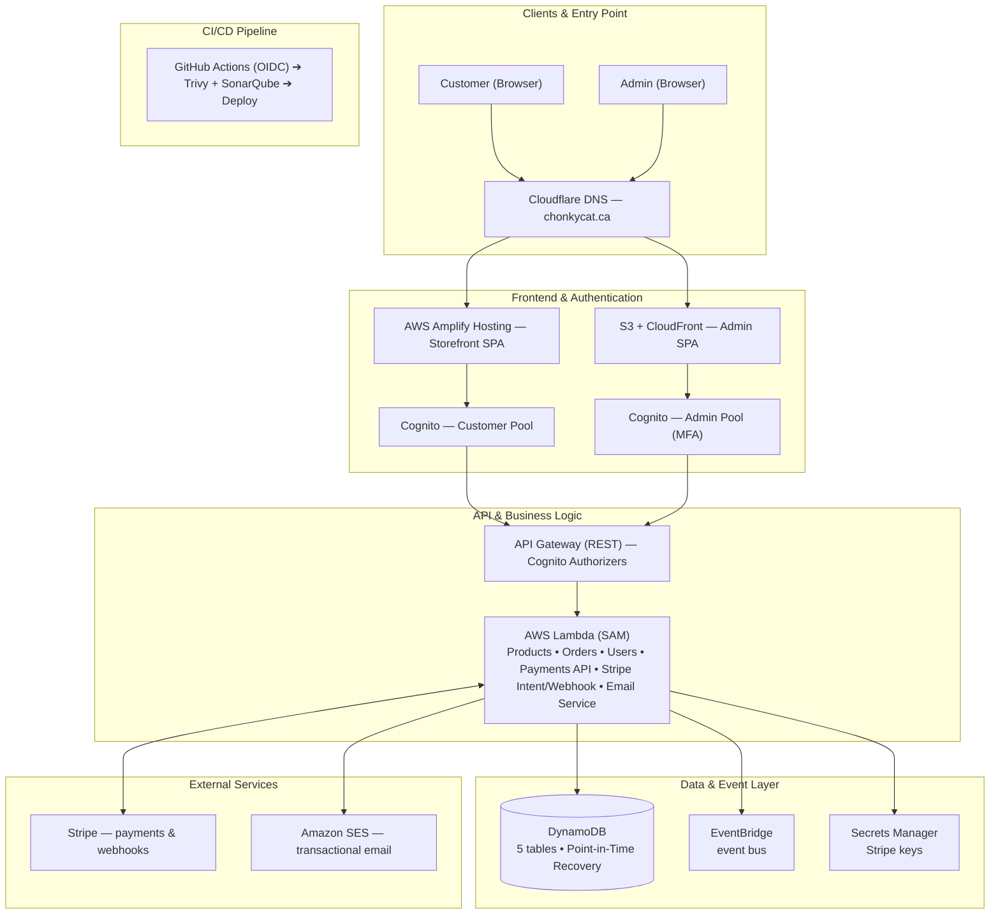

# chonky-infra

Terraform infrastructure for the Chonky stack.

## Architecture



### Component Breakdown

**Frontend & Authentication**
- Customer Access: AWS Amplify Hosting (Storefront SPA) integrated with a dedicated Cognito Customer Pool.
- Admin Access: S3 + CloudFront distribution (Admin SPA) protected by a separate Cognito Admin Pool with Multi-Factor Authentication (MFA).
- DNS: Managed via Cloudflare DNS for `chonkycat.ca`.

**Backend & API Layer**
- API Gateway (REST): Enforces route authorization using Cognito Authorizers.
- AWS Lambda (SAM): Serverless compute engine hosting endpoints for Products, Orders, Users, Payments, Stripe Intent/Webhooks, and Email Services.

**Data & Integration Layer**
- DynamoDB: Primary database utilizing 5 tables with Point-in-Time Recovery (PITR) enabled.
- EventBridge: Event bus for asynchronous event driven communication.
- Secrets Manager: Secure storage for Stripe API keys and credentials.
- External Integrations: Stripe for payment intents and webhooks; Amazon SES for transactional emails.

**CI/CD Pipeline**
- GitHub Actions: OIDC-authenticated deployment pipeline running security scans via Trivy and code quality checks via SonarQube before deployment.

## Structure

```
chonky-infra/
├── bootstrap/                    # One-time setup: S3 state bucket, DynamoDB lock table
├── secrets/                      # Secrets Manager secrets (Stripe key, etc.)
├── deployments/
│   ├── dynamodb/                # DynamoDB tables (users/products/orders/payments/promotions)
│   ├── cognito/                 # Cognito user pools (customers + admins)
│   ├── admin-hosting/           # Admin SPA hosting (S3 + CloudFront, Cloudflare DNS, GitHub Actions OIDC deploy role)
│   ├── ses/                     # SES domain identity, DKIM, bounce/complaint tracking
│   ├── lambdas/                 # chonky-cat-be backend: Lambdas, EventBridge, REST API
│   │   ├── backends/
│   │   ├── dev.tfvars
│   │   └── main.tf
│   └── amplify-fe/              # chonky-cat-fe customer storefront hosting (AWS Amplify Gen2 + IAM deploy role)
├── dynamodb_loader/              # Seeds the DynamoDB tables with dev/test data
├── dev_image_loader/             # Seeds an S3 bucket with placeholder product images
├── disaster_recovery/            # DR demo script + baseline captures (see DISASTER_RECOVERY.md)
├── modules/
│   ├── s3/                       # S3 bucket module
│   ├── cognito/                  # Cognito user pool + app client module
│   ├── ses/                      # SES domain identity + DKIM + SNS bounce/complaint module
│   ├── spa-hosting/              # S3 + CloudFront SPA hosting module
│   ├── lambda/                   # Lambda function module
│   └── git_deploy/               # Generic git-clone-and-run-a-command module (used by lambdas' backend checkout)
└── scripts/
    └── new-env.sh                # Scaffolds/removes backends/<env>.hcl + <env>.tfvars for a new environment
```

Each `deployments/*` directory follows the same shape (`backends/`, `dev.tfvars`, `main.tf`) even where not shown above.

See [DISASTER_RECOVERY.md](./DISASTER_RECOVERY.md) for the DynamoDB point-in-time-recovery runbook.

## Deployment Order

1. **bootstrap/** — Creates S3 state bucket and DynamoDB lock table (one-time setup)
2. **secrets/** — Stores the Stripe secret key in Secrets Manager
3. **deployments/dynamodb/** — Creates the DynamoDB tables (users, products, orders, payments, promotions)
4. **deployments/cognito/** — Creates the Cognito user pools (customers, admins)
5. **deployments/ses/** — Verifies the SES sending domain (DKIM, bounce/complaint tracking via SNS)
6. **deployments/lambdas/** — Deploys the chonky-cat-be backend: Lambda functions, shared layer, EventBridge bus/rule, and REST API Gateway (depends on dynamodb + secrets). **Also requires the chonky-cat-fe Amplify app to already exist** — see below.
7. **deployments/admin-hosting/** — Admin SPA hosting: S3 + CloudFront (Cloudflare DNS), plus a GitHub Actions OIDC role scoped to the `chonkycat-admin` repo's deploy workflow. Requires `TF_VAR_cloudflare_api_token` / `TF_VAR_cloudflare_zone_id`, same as `deployments/ses`.
8. **dynamodb_loader/** — Seeds the DynamoDB tables with dev/test data (optional, dev convenience)
9. **dev_image_loader/** — Provisions an S3 bucket + CloudFront (OAC) + Cloudflare DNS, then seeds it with placeholder product images (optional, dev convenience). Requires `TF_VAR_cloudflare_api_token` / `TF_VAR_cloudflare_zone_id`, same as `deployments/ses`.

`deployments/amplify-fe/` exists as Terraform code for the customer storefront's Amplify app + IAM deploy role, but has never actually been applied — the real app was connected manually. See "The Amplify app must be deployed manually" below.

### The Amplify app must be deployed manually before `deployments/lambdas`

`deployments/lambdas` passes `--amplify-app-id` to `deploy-products.sh` so the
backend's CORS logic (`shared/cors.py` in `chonky-cat-be`) can allow browser
requests from `https://<branch>.<app-id>.amplifyapp.com`. It resolves that id
by shelling out to `aws amplify list-apps` and filtering by name (see
`deployments/lambdas/scripts/lookup-amplify-app-id.sh`) — **not** from
Terraform state, since the AWS provider has no data source for looking up an
existing Amplify app (`aws_amplify_app` is resource-only, for creating one),
and `deployments/amplify-fe/` — which would create it — has never actually
been applied.

That means the Amplify app has to exist *before* `deployments/lambdas` can
apply: connect the `chonky-cat-fe` GitHub repo in the Amplify Console (or
however you provision it) first, under the same name
`deployments/lambdas/variables.tf`'s `amplify_app_name` expects (default
`"chonkycat-fe"`). If the lookup script can't find a matching app, it fails
loudly rather than silently deploying with CORS broken.

## Adding a New Environment

Every component in `deployments/` (plus `secrets/`, `dynamodb_loader/`, `dev_image_loader/`) follows the same per-environment shape: `backends/<env>.hcl` (S3 backend config) and `<env>.tfvars` (variables). `dev` and `production` already exist. For any other environment, use `scripts/new-env.sh` rather than hand-copying `dev`'s files — it makes the new environment's naming collision-proof by construction instead of discovering conflicts one `terraform apply` at a time (ask about `chonky-tfstate-production` or `chonky-admin-production` if you want the story — both turned out to already be claimed by other AWS accounts).

```bash
./scripts/new-env.sh staging
```

This generates, from each component's `dev.tfvars` / `backends/dev.hcl`:

- `bootstrap/staging.tfvars` — bootstrap has no committed per-env tfvars beyond what's described in Quick Start below; this gives a new environment one instead of hand-editing `bootstrap/variables.tf`'s default.
- `<component>/backends/staging.hcl` — S3 backend pointed at `chonky-tfstate-staging-<your-account-id>`. The account id is baked into the bucket name because S3 bucket names are unique across *all* AWS accounts, not just yours — this guarantees it can never collide with someone else's bucket the way `chonky-tfstate-production` did.
- `<component>/staging.tfvars` — copied from `dev.tfvars`, with `env` updated and `*.chonkycat.ca` domains/callback URLs rewritten to a `staging-` prefix so they don't collide with production's bare domain either.

It only writes files — it never runs Terraform or touches AWS. **Review the generated files before applying**, especially domain names, callback URLs, and any Cloudflare token or personal email copied verbatim from `dev.tfvars`. It refuses to overwrite existing files unless you pass `--force`, and refuses `dev`/`prod`/`production` as a name. Then deploy in the same order as above, pointing at `staging.tfvars` / `backends/staging.hcl` instead of `dev`'s.

### Removing a Generated Environment

```bash
./scripts/new-env.sh staging --remove
```

Deletes the scaffold files `new-env.sh` created for that environment — nothing more. It does **not** run `terraform destroy` or touch any AWS resource. If the environment was actually applied, destroy its real infrastructure first (component by component, reverse of the deploy order above) — otherwise you're left with real S3 buckets/DynamoDB tables/Cognito pools/etc. still running with no local config left to manage them. Prompts for confirmation (type the environment name) unless you pass `--yes`.

## Secrets Management

Sensitive values (API keys, etc.) should never be committed to version control. Use environment variables instead:

### Setup

1. Set environment variables before deploying:
   ```bash
   export TF_VAR_stripe_secret_key="your-stripe-key"
   eval "$(./secrets/create-stripe-webhook.sh)"  # sets TF_VAR_stripe_webhook_secret
   ```

2. Deploy secrets:
   ```bash
   cd secrets
   terraform apply -var-file="dev.tfvars"
   ```

### Or use a deployment script

Create `secrets/deploy.sh` (git-ignored):
```bash
#!/bin/bash
export TF_VAR_stripe_secret_key="your-stripe-key"
eval "$(./create-stripe-webhook.sh)"
terraform apply -var-file="dev.tfvars"
```

Then:
```bash
chmod +x secrets/deploy.sh
./secrets/deploy.sh
```

### For production

Use AWS Secrets Manager, HashiCorp Vault, or your organization's secret management service.

## Quick Start

```bash
# 1. Bootstrap (one-time per environment) — bootstrap uses local state, not
#    an S3 backend, and has no committed per-env tfvars beyond variables.tf's
#    own default. dev/production are already set up this way; anything else
#    should go through scripts/new-env.sh instead (see "Adding a New
#    Environment" above), which generates a proper bootstrap/<env>.tfvars.
cd bootstrap
terraform init
terraform apply                  # dev — variables.tf's default env, no bucket_suffix
terraform apply -var="env=prod"  # production — real bucket is chonky-tfstate-prod

# 2. Secrets (set environment variables first)
export TF_VAR_stripe_secret_key="your-stripe-key"
eval "$(./secrets/create-stripe-webhook.sh)"  # sets TF_VAR_stripe_webhook_secret

cd secrets
terraform init -backend-config=backends/dev.hcl
terraform apply -var-file="dev.tfvars"

# 3. DynamoDB tables
cd ../deployments/dynamodb
terraform init -backend-config=backends/dev.hcl
terraform apply -var-file="dev.tfvars"

# 4. Cognito user pools
cd ../cognito
terraform init -backend-config=backends/dev.hcl
terraform apply -var-file="dev.tfvars"

# 5. SES domain identity (DKIM, bounce/complaint tracking) — this and
#    everything below touches Cloudflare DNS (SES validation records,
#    lambdas' optional custom domain, the image CDN's domain), so set these
#    once and they're reused for the rest of Quick Start:
export TF_VAR_cloudflare_api_token="your-cloudflare-api-token"   # Zone.DNS edit permission
export TF_VAR_cloudflare_zone_id="your-cloudflare-zone-id"       # chonkycat.ca zone, from its Overview page

cd ../ses
terraform init -backend-config=backends/dev.hcl
terraform apply -var-file="dev.tfvars"

# 6. Backend Lambda functions (chonky-cat-be), EventBridge, REST API
cd ../lambdas
terraform init -backend-config=backends/dev.hcl
terraform apply -var-file="dev.tfvars"

# 7. Product images (dev convenience) — S3 + CloudFront + Cloudflare DNS,
#    reuses the Cloudflare credentials exported in step 5
cd ../../dev_image_loader
terraform init -backend-config=backends/dev.hcl
terraform apply -var-file="dev.tfvars"
```
